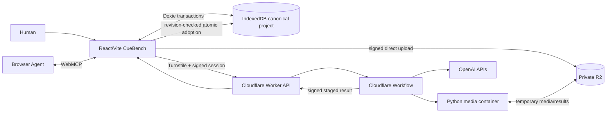

# CueBench Core Design

**Status:** Approved in conversation on 2026-08-29

**Product context:** Core Authoring

**Visual direction:** Calibration Bench

**Implementation status:** Design only; no application code exists yet

## 1. Summary

CueBench is a hosted, no-account caption and audio-description workbench where a person, CueBench AI, and an optional personal Browser Agent collaborate against the same visible video timeline. It produces working caption and audio-description exports while preserving human authority over names, meaning, timing, description choices, warning waivers, rulings, and certification.

Core serves a teacher preparing a short recorded lesson for Deaf and hard-of-hearing learners. The complete session is: open a bundled sample or upload a video, generate caption evidence and proposals, generate optional audio-description proposals, focus problems on the shared timeline, remediate bounded selections with a Browser Agent, make human rulings, validate, certify an immutable snapshot, and export round-trip-verified files.

CueBench uses hosted processing where it is more reliable and WebMCP where shared page state matters. Cloudflare and OpenAI create evidence and initial proposals. WebMCP exposes the current project, playhead, selection, evidence, findings, and review state to the person's Browser Agent. The human interface remains complete without WebMCP.

This specification covers Core Authoring only. The context map deliberately separates later Capture & Ingest, Localization, Voice & Mix, and Professional Scale work.

## 2. Product case

### 2.1 Problem

Automatic captions commonly mishandle proper names and technical terms, produce unreadable cue boundaries, merge speakers, and miss important silent visuals. General agents and file-based tools can process a video, but they do not automatically share the editor's visible selection, playhead, evidence, review state, or human rulings. The person is left reconciling a text file with the media by hand.

### 2.2 WebMCP fit

Caption remediation is page-dependent work. “Fix this cue,” “move the end to the breath,” or “describe the diagram in this gap” refers to a visible, transient focus inside an interactive artifact. CueBench exposes that focus through narrow, revision-guarded WebMCP tools. This gives a compatible personal Browser Agent a zero-install way to inspect and change the same artifact the person is reviewing.

WebMCP is not required for transcription or batch media processing. Those operations belong in a reliable hosted pipeline. The product advantage is the combination: hosted generation creates the draft; WebMCP enables contextual negotiation on the live project; human-only rulings and certification preserve accountability.

### 2.3 Goals

- Deliver one complete, coherent caption and audio-description authoring workflow.
- Make video, time, evidence, proposals, findings, and decisions visible together.
- Produce usable VTT, SRT, AD VTT, AD TXT, and project-backup files.
- Preserve immutable provenance and human authority.
- Demonstrate non-trivial dynamic WebMCP registration, cancellation, stale-state protection, and verification.
- Run online without accounts while keeping the browser project canonical.
- Target WCAG 2.2 AA for the application interface.

### 2.4 Non-goals

- Legal or WCAG conformance certification.
- Rendered audio-description mixes or dubbed video.
- Long-video, organizational, or multi-user project storage.
- URL, webcam, and screen-recording ingest in Core.
- Translation and localization.
- Generic chat, generic editing, or unconstrained bulk-agent mutation.
- A claim that uploaded media remains on the device.
- Invented customer, productivity, accessibility, or time-savings claims.

## 3. Scope and actors

### 3.1 Core limits

- Bundled sample and local-file upload.
- One source video per project.
- Maximum source duration: 15 minutes.
- Maximum source size: 500 MB.
- Source-language captions.
- Full audio-description beat authoring, narration preview, and timed-text/script export.
- Browser-canonical anonymous projects.
- Current WebMCP-capable Chrome/ChatGPT Browser Agent as the submission's release target; feature-detected human fallback elsewhere.

### 3.2 Actors and authority

| Actor | May do | Must not do |
| --- | --- | --- |
| Human | Author, Object, Sustain, apply profiles, waive warnings, relink media, import backups, certify, delete projects | None within the human UI except bypass structural blockers |
| Browser Agent | Inspect live state and evidence; propose or revise selected work; mark its revision Agent Ready; prepare certification review | Rule, waive, apply a profile, replace media, import a backup, or certify |
| CueBench AI | Produce hosted evidence and Proposed captions or AD beats | Attest that its own generating pass is Agent Ready; rule or certify |
| System | Validate, migrate, serialize, recover, enforce quotas, and record deterministic events | Author semantic content or make human judgments |

Professional Scale may later add a secondary QA agent and a separate Batch Automation Mode. The generating pass still cannot attest to itself, batch tools cannot overlap Core's selection-scoped tools in one agent context, and neither gains human authority.

## 4. End-to-end experience

1. The person opens the bundled project or chooses a supported local video.
2. CueBench estimates browser storage, requests persistent storage where available, and explains temporary-session fallback.
3. Before cloud upload, CueBench discloses Cloudflare processing, OpenAI involvement, retention, and deletion behavior.
4. The browser creates a signed anonymous operation and uploads directly to private R2.
5. A visible, cancellable Caption Generation Run prepares media, creates two transcription passes, aligns evidence, reconciles bounded uncertainty, validates segmentation, and atomically adopts Proposed cues.
6. The person or Browser Agent focuses a finding or selects a cue. Video, playhead, waveform, cue span, evidence, docket, and scoped WebMCP tools synchronize.
7. The Browser Agent may adjust timing, split, merge, or revise the selected proposal. The human may Object or Sustain the resulting revision.
8. A separate AD Generation Run uses frames, transcript context, scene boundaries, and speech gaps to produce Proposed beats. Extended-description requirements are recorded when important visual information cannot fit.
9. The person previews selected narration through cached TTS, adjusts the beat, and rules on it.
10. CueBench validates the complete project. The person resolves blockers and may explicitly waive warnings.
11. `prepare_certification_review` assembles evidence for review, but only the human UI can certify the exact snapshot.
12. CueBench serializes the requested export, parses it back, compares normalized content with the source snapshot, and then offers the download.

The bundled sample follows the same path. A clearly labelled deterministic replay may stand in only when external generation is unavailable; the submission recording uses real generation.

## 5. Domain model

The Core glossary in `CONTEXT.md` is normative. The principal aggregates and value objects are:

- **Caption Project:** source-media identity, current profile, tracks, evidence, findings, generation history, Court Record, and certifications.
- **Media Source:** browser-held video, SHA-256 identity, technical metadata, duration, and relink state.
- **Caption Track / Audio-Description Track:** ordered stable item identities and their current revisions.
- **Caption Cue / Audio-Description Beat:** stable logical item identities.
- **Revision:** immutable timing, text, speaker or narration metadata, evidence links, actor, cause, and parent revision.
- **Evidence:** aligned words, uncertainty spans, scene timestamps, representative frames, speech gaps, and bounded evidence windows.
- **Quality Profile / Profile Revision:** human-controlled deterministic rules.
- **Quality Finding:** profile- and revision-bound blocker or warning.
- **Generation Run:** staged, visible, cancellable, atomic production process with provenance.
- **Certification Snapshot:** immutable human-approved binding of media, item revisions, profile, validation, and warning waivers.
- **Court Record:** append-only actor-attributed project history.

### 5.1 Review-state machine

Current revisions use four review states:

- `Proposed`: created or changed by CueBench AI or a Browser Agent and awaiting review.
- `Agent Ready`: a Browser Agent asserts that its revision is ready for human review.
- `Objected`: a human rejects the current revision with a reason.
- `Sustained`: a human accepts that exact revision.

Any semantic or timing change to a Sustained item creates a new Proposed revision. The Sustained revision remains in history. Human Object and Sustain actions are not registered as WebMCP tools.

### 5.2 Core invariants

1. Canonical media times are integer milliseconds.
2. Stable items contain immutable revisions; undo creates another revision.
3. Every mutation increments the Project Revision and appends a Court Record entry in one transaction.
4. Mutations with stale project, item, or selection revisions change nothing.
5. A Generation Run commits its staged result atomically or adopts nothing.
6. Only one Generation Run operates at a time and it leases only its target track.
7. A generating pass cannot mark its own revisions Agent Ready.
8. Only humans may rule, waive, apply profile changes, or certify.
9. Profile changes invalidate full validation and current certification.
10. Relevant track changes preserve historical certifications but make them non-current.
11. Structural blockers cannot be waived.
12. Certified exports come only from a current Certification Snapshot with no blockers.

## 6. Quality model and certification

The Education Quality Profile is the default. A person may configure caption duration, reading speed, line length/count, gaps, overlaps, speaker-transition behavior, and AD/speech collision rules. A Browser Agent may submit an immutable profile diff with rationale; the human must apply it.

Validation is deterministic and full-project. Mutations may return an incremental finding delta for immediate feedback, but only a complete run supports certification. Core checks include:

- Cue and beat timing bounds.
- Overlaps, negative gaps, and invalid ordering.
- Minimum and maximum duration.
- Reading speed and line length/count.
- Empty or duplicate items.
- Speaker-transition consistency.
- AD overlap with foreground dialogue.
- Stale evidence or review state.
- Unsupported or unresolved structural export conditions.

Warnings can be waived only by a human with a recorded reason. At least one current Sustained item is required before certification. Passing validation means the project satisfies the selected deterministic profile; it is not a legal or accessibility-conformance claim.

A Certification Snapshot binds the source-media hash, item revisions, profile revision, validation result, warning waivers, human actor, and timestamp. Draft export remains available independently. Certified export labels and filenames must state that they derive from the latest current certification.

## 7. System architecture

### 7.1 Workspace boundaries

The implementation uses a `pnpm` workspace:

- `apps/web`: React SPA, Cloudflare Worker routes, and Workflow definitions.
- `services/media`: Python 3.12, `uv`, FastAPI, FFmpeg, and FFprobe container.
- `packages/domain`: pure commands, invariants, validation, and export normalization.
- `packages/contracts`: versioned Zod request, result, event, and error contracts.
- `packages/webmcp`: registration lifecycle and tool adapters over domain commands.
- `packages/test-fixtures`: synthetic projects, media metadata, transcripts, evidence, and expected exports.

The domain command layer does not depend on React, WebMCP, Cloudflare, or Dexie. Infrastructure adapters translate versioned contracts at the boundary. UI components invoke the same commands used by WebMCP adapters.

### 7.2 Browser ownership

IndexedDB, accessed through Dexie, is canonical for anonymous Core projects, source video blobs, local evidence packages, revisions, findings, Court Record entries, certifications, cached narration, and signed recovery receipts. Every domain command is one Dexie transaction.

Before ingest, CueBench estimates storage and requests persistence. When durable quota is inadequate, it offers an explicit temporary-session project. It never presents that mode as durably saved.

### 7.3 Hosted responsibilities

The Worker owns anonymous sessions, Turnstile, quotas, idempotency, signed R2 access, Workflow control, OpenAI credentials, status, recovery, and privacy-safe telemetry. The Workflow persists stage transitions and retries. The media container probes and normalizes media, extracts audio, builds waveform peaks, detects scenes, and creates small WebP evidence thumbnails. The container never receives OpenAI secrets.

Cloud job storage is processing state, not a collaborative cloud project.

## 8. Generation pipelines

### 8.1 Media preparation

The browser validates obvious type, duration, and size constraints. The container then performs authoritative probing, codec checks, normalization, audio extraction, a 10 ms multi-resolution waveform peak pyramid, scene-change detection, and bounded representative thumbnails. Unsupported input fails before model calls where possible.

### 8.2 Caption evidence and proposals

Caption generation performs two OpenAI transcription passes:

1. `gpt-4o-transcribe-diarize` for speaker-segment evidence, using `chunking_strategy: auto` beyond 30 seconds.
2. `whisper-1` for word-level timestamp evidence.

Deterministic alignment normalizes text and relates overlapping word and speaker intervals without inventing certainty. Disagreement becomes an Uncertainty Span. Bounded reconciliation may correct only evidence-linked words and must preserve links to the source passes. The default reasoning-model role is `gpt-5.6-terra`; the resolved model, parameters, schema, prompts, usage, warnings, and hashes are recorded as Generation Provenance. OpenAI requests use `store: false`.

After reconciliation, deterministic Quality Profile rules segment words into Proposed cues. Existing Sustained items are never silently overwritten. Replacing existing Proposed work requires visible human confirmation.

### 8.3 Audio-description proposals

AD generation runs after caption evidence exists. It divides the media into adaptive 45–90-second overlapping windows. Each request receives surrounding transcript evidence, speech gaps, scene boundaries, and at most 12 representative frames. The model proposes essential visual descriptions and evidence links. Deterministic placement selects compatible gaps, removes duplicates across windows, checks timing, and creates Extended-Description Requirements when important content cannot fit without competing with dialogue.

Core previews selected narration through `gpt-4o-mini-tts`, with `marin` as the default voice. The browser caches the preview and measured duration. A duration mismatch may become a finding. Core does not render a mixed video.

### 8.4 Concurrency and adoption

Only one Generation Run operates per project. Caption generation precedes AD generation. A run obtains a Target-Track Write Lease: the target remains inspectable but not mutable, while the other track remains editable. Successful results are adopted only when the expected Project Revision still permits it. Cancelled or exhausted runs adopt nothing.

## 9. WebMCP design

CueBench feature-detects `document.modelContext.registerTool`. Tool execution invokes domain commands, updates IndexedDB and the visible interface, and only then returns structured verification. Tool results are compact, bounded, and include the new revisions plus valid `next_actions`.

### 9.1 Always-registered tools

| Tool | Purpose |
| --- | --- |
| `inspect_project` | Read project identity, media, tracks, selected item, run, validation, certification, and revisions |
| `inspect_timeline_window` | Read bounded caption, AD, evidence, and finding state for a Media Time interval |
| `list_quality_findings` | Page and filter current blockers and warnings |
| `focus_quality_finding` | Select, seek, reveal evidence, and activate the applicable scoped family |
| `start_caption_generation` | Start a visible Caption Generation Run without overwriting Sustained work |
| `start_ad_generation` | Start a visible AD Generation Run after caption evidence exists |
| `validate_project` | Run complete deterministic validation |
| `export_track` | Export a draft or latest-certified caption/AD track in a supported format |
| `propose_profile_patch` | Create a non-applied Quality Profile diff for human review |
| `prepare_certification_review` | Assemble current certification readiness without certifying |

While a Generation Run is active, the two generation starters are removed and replaced with:

| Tool | Purpose |
| --- | --- |
| `inspect_generation_run` | Read current stage, progress, warnings, retryability, and receipt state |
| `cancel_generation_run` | Cancel the visible run and preserve atomic no-adoption semantics |

### 9.2 Selection-scoped tools

Exactly one scoped family is registered at a time. The previous family's `AbortSignal` is aborted before the new family is exposed.

**Selected caption cue**

- `inspect_selected_cue_evidence`
- `adjust_selected_cue_timing`
- `split_selected_cue`
- `merge_selected_cue`
- `revise_selected_cue`
- `mark_selected_cue_agent_ready`

**Selected AD beat**

- `inspect_selected_ad_evidence`
- `adjust_selected_ad_timing`
- `revise_selected_ad_beat`
- `preview_selected_narration`
- `mark_selected_ad_agent_ready`

**Selected undescribed gap**

- `inspect_selected_gap_evidence`
- `propose_ad_beat_in_gap`

Selection-scoped mutations require the expected selection ID, item revision, and Project Revision. Timing tools accept integer milliseconds and perform their own arithmetic. Merge is adjacent-only. Finding focus establishes the selection and opens its evidence before returning.

### 9.3 Human-only boundaries

The following never appear as Core WebMCP tools:

- Sustain or Object.
- Apply a profile proposal.
- Waive a warning.
- Certify a project.
- Replace or relink media.
- Import a project backup.
- Delete a project.
- Generic editing or bulk fixing.

Mutating Sustained work and replacing existing proposals require cancellable in-page confirmation. Export and generation cancellation may execute directly because their target and consequences are explicit. A development-only drawer at `?webmcpDebug=1` shows sanitized registrations, schemas, calls, results, revision changes, cancellation, and errors.

## 10. Interface and visual direction

The approved direction comp is `.impeccable/mocks/decision/calibration-bench.png`. It establishes the **Calibration Bench** world: caption timing is treated as a measured signal that a teacher and agent calibrate against visible evidence.

The visual system uses cool bone work surfaces, graphite instrument housings, restrained signal green, attention amber, slate secondary readings, etched measurement grids, and precise workhorse typography. Technical numerals are reserved for time and measurements. Caption, evidence, error, and action prose remains highly readable. This is an instrument grammar, not literal science-lab decoration.

### 10.1 Workspace topology

1. Compact header for project, persistence, generation, validation, and Browser Agent state.
2. Evidence-dominant video bay using the native video element as the authoritative clock.
3. Custom shared timeline with waveform, captions, AD, findings, and playhead lanes.
4. Review docket with complete semantic editing, evidence, findings, revisions, and actions.
5. Collapsible Court Record across the lower edge.

Selection establishes one shared Media Time reference across all regions. Progressive density reveals precise editing only when relevant. Every state uses text, shape, and color. No side chat, courtroom decoration, neon instrument fantasy, generic dark editor, or pointer-only editing is allowed.

### 10.2 Timeline implementation

CueBench owns the multi-lane timeline rather than adapting a waveform library's domain model. Canvas draws the waveform peak pyramid. Semantic DOM/SVG represents cues, beats, findings, selection, and controls. A single integer-millisecond time-to-pixel transform controls rendering, seeking, hit testing, keyboard movement, drag preview, and WebMCP results. A drag previews locally and commits one validated domain command on release.

The docket is the complete keyboard and screen-reader alternative. At narrower widths it becomes a resizable or full-height panel and the Court Record becomes a drawer. Reduced-motion settings remove non-essential transitions.

Before implementation, the comp-led Impeccable workflow must retain the chosen direction comp as composition option one, generate two structural variations, obtain approval, and use the approved composition as the implementation reference. `DESIGN.md` is written from the finished system after implementation and review, not invented in advance.

## 11. Export, backup, and portability

Supported track exports are caption VTT/SRT and AD VTT/TXT. Export accepts either the current draft or the latest current Certification Snapshot. Filenames explicitly include `.draft` or `.certified` before the format extension.

Before download, CueBench serializes the track, parses it back through its own importer, normalizes both representations, and compares timing, text, ordering, and supported metadata. A mismatch blocks the download and reports an export error. A Round-Trip Verified Export does not imply project validation or certification.

Project backup is a versioned `.cuebench.json` file that includes project structure, revisions, evidence, findings, profiles, Court Record, certifications, hashes, and export metadata but excludes source video. Import is human-only. The person relinks the original media, and CueBench verifies its SHA-256 hash before restoring editable state.

Schema migrations are ordered and stepwise. Import creates a safety backup before migration. A backup from a newer unsupported schema opens read-only rather than being destructively downgraded.

## 12. Privacy, security, and operations

### 12.1 Anonymous safeguards

- Turnstile verification and signed short-lived anonymous sessions.
- Idempotent operation IDs for upload, generation, TTS, cancel, and cleanup.
- Private R2 with scoped signed operations.
- Authoritative type, codec, size, duration, and ownership checks.
- Per-session and abuse-resistant IP-level limits.
- One active run per project and a global spend circuit breaker.

Initial configurable per-session, per-24-hour limits are 30 processed media-minutes, six Generation Runs, and 50 Narration Previews.

### 12.2 Disclosure and retention

The pre-upload disclosure names cloud processing, OpenAI involvement, browser-canonical persistence, temporary retention, and deletion behavior. Successful or cancelled jobs request immediate temporary-media deletion. Failed or detached jobs may retain private recovery artifacts for at most 24 hours. R2 lifecycle rules are the backstop.

Human-confirmed project deletion cancels active work, requests cloud cleanup, removes IndexedDB state and cached narration, and reports cleanup that remains pending.

### 12.3 Observability

First-party operational telemetry may record salted identifiers, byte size, duration, stage timing, model usage/cost, status, and classified errors. It must not record media, frames, captions, transcripts, speaker names, filenames, source URLs, or exports. Local, preview, and production use separate bindings, buckets, secrets, quotas, and dashboards. The public demo fails closed when verification or the spend breaker is unavailable.

## 13. Errors and recovery

Contracts use versioned structured errors. At minimum, clients distinguish:

- Unsupported or invalid media.
- File-size or duration limit.
- Browser-storage insufficiency.
- Turnstile/session failure.
- Quota or spend-breaker rejection.
- Upload expiration or ownership mismatch.
- Generation stage failure, retryable or terminal.
- Cancellation.
- Stale project, item, selection, or run revision.
- Confirmation declined.
- Target-track lease conflict.
- Validation blocker.
- Certification out of date.
- Export round-trip mismatch.
- Backup schema unsupported or media hash mismatch.
- Recovery artifact expired.

Errors state what changed, what did not change, whether retry is safe, and the next human or agent action. A failed mutation never returns apparent success merely because the UI optimistically previewed it. Recovery receipts allow an anonymous browser to reconnect to unfinished hosted work without creating an account.

## 14. Verification strategy

### 14.1 Domain and property tests

Vitest covers commands, immutable revisions, review transitions, certification invalidation, profile proposals, waivers, leases, atomic adoption, Court Record attribution, and errors. Property tests exercise timing arithmetic, split/merge boundaries, validation ordering, migrations, and export normalization.

### 14.2 UI and accessibility tests

Component tests cover playback synchronization, selection propagation, drag preview/commit, keyboard editing, focus management, live announcements, human confirmations, progressive density, temporary-session warnings, and reduced motion. Automated accessibility checks are supplemented by keyboard and screen-reader-oriented Playwright scenarios.

### 14.3 Infrastructure tests

Pytest covers media-service validation and deterministic transforms. Wrangler integration tests cover signed sessions, quotas, idempotency, Workflow retry/recovery, R2 authorization and cleanup, contract versions, and telemetry redaction.

### 14.4 Browser and WebMCP evaluations

Playwright exercises bundled-sample and upload flows with and without WebMCP. Agent evaluations cover discovery, correct tool choice, sequencing, dynamic registration, AbortSignal cancellation, bounded inspection, stale revisions, invalid arguments, confirmation boundaries, prohibited human actions, and post-mutation verification.

Release verification targets the current WebMCP-capable Chrome/ChatGPT browser used by judges. Other browsers retain the human UI through feature detection.

## 15. Demonstration and impact evidence

The original 90-second two-speaker sample contains “Gibbs free energy,” “Dr. Nguyen,” an ambiguous joke, visible slide text, an important silent diagram, and deliberate caption and AD challenges. It ships with reference captions and expected findings.

The sub-three-minute demonstration proves:

1. Real hosted generation.
2. A visible validation finding.
3. Browser Agent focus on the affected evidence.
4. Selection-scoped WebMCP remediation.
5. A human ruling.
6. An AD proposal in a detected gap.
7. Revalidation and human certification.
8. VTT download and successful re-import.
9. Actor attribution in the Court Record.

The local Impact Summary reports initial and resolved findings, review-state counts, human interventions, certification state, and round-trip results. These are reproducible project facts rather than estimated market outcomes.

## 16. Acceptance criteria

CueBench Core is ready for the hackathon demonstration when all of the following are true:

- The hosted application works from a public URL without an account.
- The bundled sample completes the real caption-generation path.
- A local video within limits can be uploaded and processed.
- Caption and AD generation are visible, cancellable, atomic, and recoverable.
- The selected cue, video, playhead, timeline, evidence, finding, and docket remain synchronized.
- Human and Browser Agent actions create distinct immutable revisions and Court Record entries.
- Human-only authority cannot be exercised through WebMCP.
- Structural blockers prevent certification; warnings require resolution or a human waiver.
- Draft and certified exports are correctly labelled and round-trip verified.
- Project backup excludes media and requires a matching hash on relink.
- Temporary cloud artifacts follow the documented deletion policy.
- The human UI remains operable when WebMCP is absent.
- Core keyboard workflows and critical screens meet the WCAG 2.2 AA target.
- WebMCP tool-selection, cancellation, stale-state, confirmation, and invalid-state evaluations pass.
- The submission video demonstrates the real collaboration loop in under three minutes.

## 17. Deferred contexts

- **Capture & Ingest:** URL import, webcam, screen recording, and broader source management.
- **Localization:** target-language subtitle tracks derived from a certified source track.
- **Voice & Mix:** rendered narration, ducking, dubbing, and final media delivery.
- **Professional Scale:** accounts, durable cloud projects, long media, secondary QA agents, and explicitly isolated batch automation.

These contexts inherit Core's revision, evidence, validation, ruling, certification, and human-authority semantics. They do not broaden Core implementation scope.

## 18. Related decisions

The accepted architectural decisions in `docs/adr/` are normative where they are more specific. ADR 0004 is superseded by ADR 0012. The context boundaries and relationships in `CONTEXT-MAP.md` remain authoritative.
